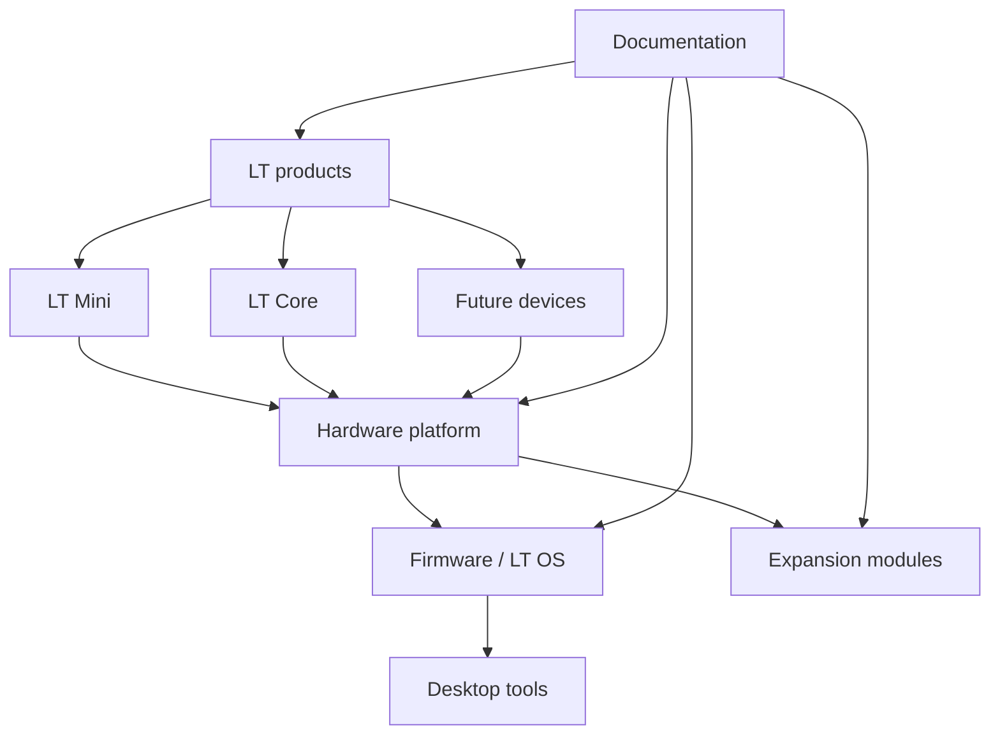

# System Architecture

The LT Ecosystem is organized around reusable hardware, firmware, desktop
software, and documentation layers.

## Main Layers

| Layer | Responsibility |
| --- | --- |
| Product layer | Defines LT Mini, LT Core, and future device variants. |
| Hardware layer | Defines compute, display, input, power, radio, storage, and expansion interfaces. |
| Firmware layer | Provides drivers, runtime services, UI, module manager, and device APIs. |
| Desktop layer | Provides Linux-first tools for flashing, configuration, logs, and file transfer. |
| Module layer | Defines external or internal hardware expansion rules. |
| Documentation layer | Records decisions, pin usage, protocols, BOMs, tests, and manufacturing notes. |

## Hardware Interface Targets

The architecture should be designed around common embedded interfaces:

- SPI
- I2C
- UART
- USB-C
- GPIO
- battery management
- modular connectors

GPIO usage must be documented for every board revision.

## Software Interface Targets

Firmware should use PlatformIO and the Arduino framework where appropriate.
The architecture should keep drivers, business logic, UI, and module management
separate enough that future ports remain realistic.

Desktop tooling should be cross-platform, with Linux as the first-class
development target and Windows support planned.

## Replacement Rule

Any subsystem can be replaced if its public interface is documented:

- display
- input controls
- LoRa module
- storage
- power subsystem
- expansion connector
- firmware driver
- desktop integration tool
