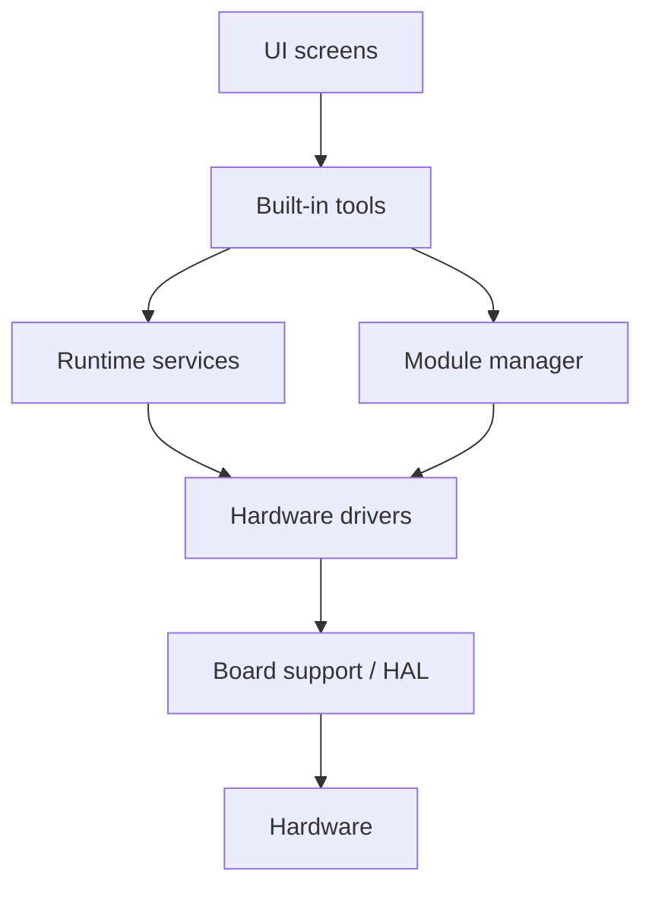

# LT OS Overview

LT OS is the firmware architecture for LT handheld devices.

The first implementation should prioritize readability, modularity, and
hardware bring-up speed over complex abstractions.

## Firmware Direction

| Area | Direction |
| --- | --- |
| Build system | PlatformIO |
| Framework | Arduino where appropriate |
| Architecture | Drivers, services, UI, and module manager kept separate |
| UI style | Minimal, functional, fast |
| Comments | Only where they explain non-obvious behavior |

## Proposed Firmware Layers

## Design Rules

- Keep raw GPIO access inside drivers or board support code.
- Keep UI screens independent from specific pin numbers.
- Use descriptive names for drivers and services.
- Avoid overengineering before hardware behavior is proven.
- Document public APIs before external modules depend on them.

## Desktop Tooling Direction

Desktop tooling should be cross-platform, with Linux as the first development
target and Windows support planned.

Possible responsibilities:

- firmware flashing
- serial logs
- device configuration
- file transfer
- module management
- diagnostics
